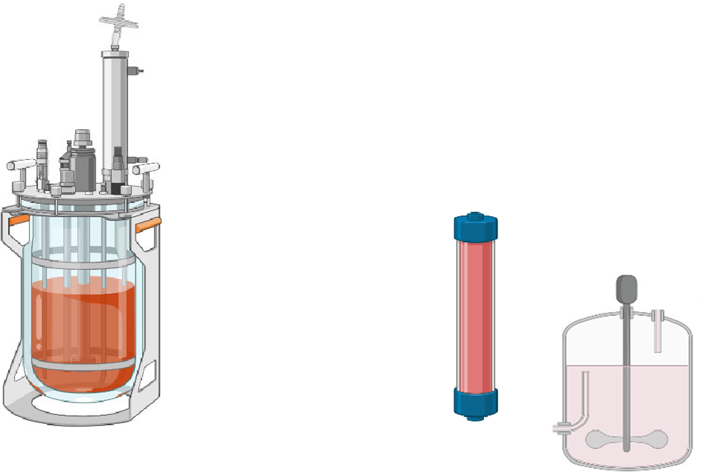
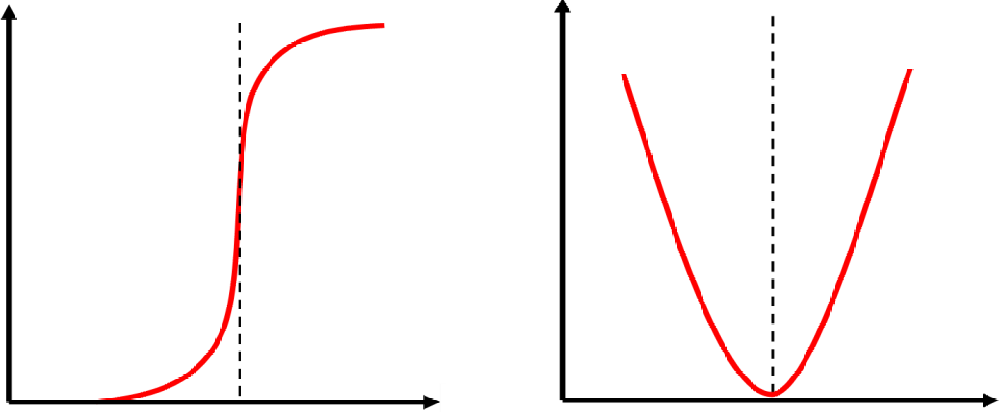

# 文献阅读分享报告

## 基本信息

- **文献标题**：Multimodal Chromatography in the Downstream Processing of mAb-Based Products: Mechanisms, Strategies, and Applications
- **期刊**：Biotechnology and Bioengineering
- **发表年份**：2026年
- **作者**：Amin Javidanbardan, Marco P. C. Marques, Ana M. Azevedo, Daniel G. Bracewell, Stephen Goldrick
- **机构**：University College London (UK), Instituto Superior Técnico (Portugal)
- **DOI**：https://doi.org/10.1002/bit.70171

---

## 文献主要内容

### 研究背景与意义

单克隆抗体（mAbs）及其衍生物（包括抗体片段Fabs、Fc融合蛋白、双特异性抗体BsAb和抗体药物偶联物ADCs）是生物制药的重要类别，但其纯化面临着巨大的挑战，主要由于结构异质性和工艺相关杂质的存在。

在mAb基产品的商业化生产中，纯化工艺主要由蛋白A亲和层析捕获步骤和离子交换层析精制步骤主导，疏水相互作用层析（HIC）使用较少，尺寸排阻层析（SEC）由于可扩展性和容量限制很少在早期开发之外使用。

**传统非亲和纯化方法的痛点**：
1. 选择性有限，通常需要多个正交步骤才能达到所需的纯度和收率
2. 处理工艺相关杂质（HCP、hcDNA、聚集体）效率不高
3. 在高电导率条件下性能下降，需要大量缓冲液交换和透析

### 核心问题

多模态层析（MMC）作为先进解决方案，通过在一个固定相中集成多种相互作用模式——静电、疏水、氢键和π-π相互作用，提供了比传统单模态层析技术更广泛的选择性窗口。

**多模态层析面临的挑战**：
1. 由于功能团的复杂相互作用（包括疏水、离子和氢键能力）与多域蛋白（如mAb）的相互作用，导致优化困难
2. 混合模式配体的暴露、形状和密度对蛋白质表面区域的选择性识别有关键影响
3. 实现一致、可重复的分离需要仔细控制配体构象、流动相修饰剂和相互作用环境，需要严格的优化

---

## 主要研究方法

### 1. 文献综述方法

本研究整合了以下来源的数据：
- 同行评议文献的实验数据
- 供应商文档
- 技术报告
- 先进分析技术（NMR、DEPC标记、分子对接、热力学分析）的分子水平见解

### 2. 研究范围

**研究重点**：
- 专门适用于工业实施的商业可用MMC树脂
- mAb基产品纯化的多模态应用
- 树脂正交性、HCP清除和聚集体去除数据
- 流动相修饰剂的影响

**排除范围**：
- 非商业或学术原型配体
- 现代亚基亲和树脂（正式分类为亲和层析）
- 传统或天然多模态材料（如羟基磷灰石）

### 3. 数据分析方法

结合以下方法进行综合分析：
- 定量结构-性质关系（QSPR）建模
- 计算机分配系数预测
- 高通量筛选
- 机制理解与经验数据的整合

---

## 解决的关键痛点

### 痛点1：传统层析选择性有限

**问题描述**：
传统离子交换层析（IEX）、疏水相互作用层析（HIC）等单模态层析技术选择性有限，难以有效去除复杂杂质混合物。

**解决方案**：
多模态层析通过在一个配体架构中结合多种相互作用模式，提供比传统单模态层析技术更广泛的选择性窗口，能够有效去除各种杂质。

### 痛点2：高电导率下性能下降

**问题描述**：
许多传统层析技术在高电导率条件下性能显著下降，需要大量的缓冲液交换或透析。

**解决方案**：
多模态层析树脂在提高的电导率下有效运行，允许直接处理澄清的CHO收获液，无需大量缓冲液交换或透析，从而简化下游工作流程并增强工艺稳健性。

### 痛点3：蛋白A成本高昂且稳定性差

**问题描述**：
蛋白A层析是mAb纯化的标准方法，但成本高，在苛刻工艺条件下的耐久性有限。

**解决方案**：
多模态层析作为蛋白A在mAb捕获步骤中的替代方案，提供了成本效益高的替代方案，在苛刻工艺条件下具有增强的耐久性。

### 痛点4：工艺优化困难

**问题描述**：
多模态层析的优化由于功能团的复杂相互作用而困难。

**解决方案**：
提出战略框架，整合分子描述符、机制理解和经验数据，指导多模态层析树脂的选择和优化。

---

## 具体方法与机制

### 1. 疏水电荷诱导层析（HCIC）

**原理**：
HCIC是为mAb纯化开发的首批多模态层析方法之一。这些配体在中性pH下不带电荷且具有疏水性，允许蛋白质通过疏水相互作用结合。当降低pH时，配体变成带正电荷，引起静电排斥并在温和条件下洗脱结合的蛋白质。

**代表性树脂**：
- **MEP HyperCel**：具有疏水脂肪尾和可电离芳香吡啶环的配体
- **HEA HyperCel**：短间隔基，pKa ~8.0
- **PPA HyperCel**：中等间隔基，pKa ~8.0
- **Nuvia wPrime 2A**：中等长间隔基，pKa ~7.4

**关键机制**：
- 在pH 7-8时通过疏水相互作用结合
- pH依赖性电荷诱导，在低pH下产生静电排斥
- 硫代基团的硫代性质可以增强结合选择性

### 2. 主要阴离子混合模式层析（MMAEX）

**代表性树脂**：
- **Capto adhere (ImpRes)**：Cytiva，琼脂糖基
- **Nuvia aPrime 4A**：Bio-Rad，聚丙烯酰胺基

**配体特性**：
- 中等长间隔基
- pKa ~3.0
- 整合静电、疏水、氢键相互作用

### 3. 分子水平相互作用机制

**关键氨基酸残基**：
- IgG Fc域的酪氨酸（Y319）和亮氨酸（L309）与MEP配体的疏水部分形成稳定接触
- Framework Region 3（HFR-3）位于VH中，同时包含亲水和疏水残基
- IgG1和IgG4由于Fc区域不同表现出不同的洗脱行为

**相互作用类型**：
- 疏水相互作用：脂肪尾
- 范德华力
- 氢键
- π-π相互作用
- 静电排斥（低pH下）

---

## 具体数据展示

### 图表1：典型mAb生产工艺流程

  
  
<strong>图1</strong>：典型mAb生产工艺流程。传统的中间/精制步骤依赖使用非亲和配体的CEX、AEX以及有时使用HIC层析。多模态配体在支架上呈现不同的相互作用，允许使用不同的精制工作流配置。

### 图表2：HCIC和主要离子多模态树脂基于pH和/或盐浓度的结合强度

  
  
<strong>图2</strong>：HCIC和主要离子多模态树脂基于pH和/或盐浓度的结合强度。（A）静电排斥将通过降低缓冲液pH低于HCIC配体的pKa来洗脱疏水结合的蛋白质。（B）主要离子多模态树脂中蛋白质的U型保留。在某个点，疏水相互作用占据主导地位，结合强度再次增加。

### 表1：商业可用的疏水电荷诱导层析（HCIC）和主要阴离子混合模式层析（MMAEX）树脂

| 配体 | 配体特征 | 树脂（品牌） | 商业名称 |
|------|----------|--------------|----------|
| **HCIC** | 短间隔基 pKa ~4.8 LogP: 1.92 (0.59) | 纤维素（Sartorius） | MEP HyperCel |
| | 短间隔基 pKa ~8.0 | | HEA HyperCel |
| | 中等间隔基 pKa ~8.0 LogP: 2.26 (1.92) | | PPA HyperCel |
| | 中等长间隔基 pKa ~7.4 | 聚丙烯酰胺（BioRad） | Nuvia wPrime 2A |
| **MMAEX** | 中等长间隔基 pKa ~3.0 | 琼脂糖（Cytiva） | Capto adhere (ImpRes) |
| | 中等长间隔基 | 聚丙烯酰胺（BioRad） | Nuvia aPrime 4A |

### 关键性能数据

**MEP HyperCel性能**：
- **动态结合容量（DBC）**：在pH 7-8时最优
- **pH敏感性**：在pH低于5时显著下降
- **HCP清除**：通常高于蛋白A层析
- **hcDNA和病毒清除**：>4.7 log清除率
- **操作条件**：在中性pH和生理条件下结合

**聚合体去除**：
- 大多数HCIC和混合模式树脂能够去除聚集体（>1 log降低）
- Capto adhere在IgG1和IgG2样品中实现>1 log聚集体降低

**树脂正交性**：
- 不同多模态树脂表现出不同的正交分离特性
- 可以根据目标杂质选择合适的树脂组合

---

## 核心结论与展望

### 主要结论

1. **多模态层析的优势**：
   - 提供比传统单模态层析更广泛的选择性窗口
   - 在高电导率下有效运行，简化工艺流程
   - 能够有效去除各种杂质，包括HCP、hcDNA、聚集体
   - 作为蛋白A捕获步骤的成本效益替代方案

2. **分子水平见解**：
   - 通过NMR、分子对接等技术阐明了抗体-配体相互作用的分子机制
   - 特定氨基酸残基（如Y319、L309）在结合中起关键作用
   - IgG亚型（IgG1 vs IgG4）表现出不同的洗脱行为

3. **工艺优化策略**：
   - 需要仔细控制配体构象、流动相修饰剂和相互作用环境
   - 整合分子描述符、机制理解和经验数据
   - 利用QSPR建模、计算机分配系数预测和高通量筛选指导树脂选择

### 未来展望

1. **技术发展**：
   - 定量结构-性质关系（QSPR）建模的进步
   - 计算机分配系数预测
   - 高通量筛选技术
   - 机制建模的进一步发展

2. **应用扩展**：
   - 在下一代生物制药纯化平台中的定位
   - 与新兴抗体格式（BsAb、ADC）的适配性
   - 连续生产工艺中的应用

3. **挑战与机遇**：
   - 产品特异性优化需求
   - 工艺可重复性保证
   - 与监管要求的一致性

---

## 文献价值与启示

### 对行业的价值

1. **首次全面比较**：本研究首次全面比较了用于抗体基产品纯化的所有商业可用多模态层析树脂
2. **综合数据分析**：整合了同行评议文献、供应商文档和技术报告的实验数据
3. **分子水平见解**：提供了来自先进分析技术的分子水平见解
4. **实用指导**：为优化mAb纯化提供了以应用为重点的资源

### 对工艺开发的启示

1. **树脂选择策略**：
   - 根据目标分子和杂质特征选择合适的多模态树脂
   - 考虑树脂的正交性以优化工艺流程
   - 利用分子描述符指导理性选择

2. **工艺优化方法**：
   - 系统优化pH、盐浓度、流动相修饰剂
   - 结合机制理解与经验数据
   - 采用高通量筛选加速开发

3. **质量控制**：
   - 关注HCP、hcDNA、聚集体等关键质量属性
   - 利用多模态层析的正交性提高杂质清除效率
   - 建立稳健的工艺参数

---

## 参考文献

原始文献：Javidanbardan, A., Marques, M. P. C., Azevedo, A. M., Bracewell, D. G., & Goldrick, S. (2026). Multimodal Chromatography in the Downstream Processing of mAb-Based Products: Mechanisms, Strategies, and Applications. *Biotechnology and Bioengineering*. https://doi.org/10.1002/bit.70171

---

**报告生成时间**：2026年4月17日  
**生成工具**：OpenClaw智能代理  
**原始PDF**：Multimodal Chromatography in the Downstream Processing of mAb-Based Products (30页, 3.9 MB)
